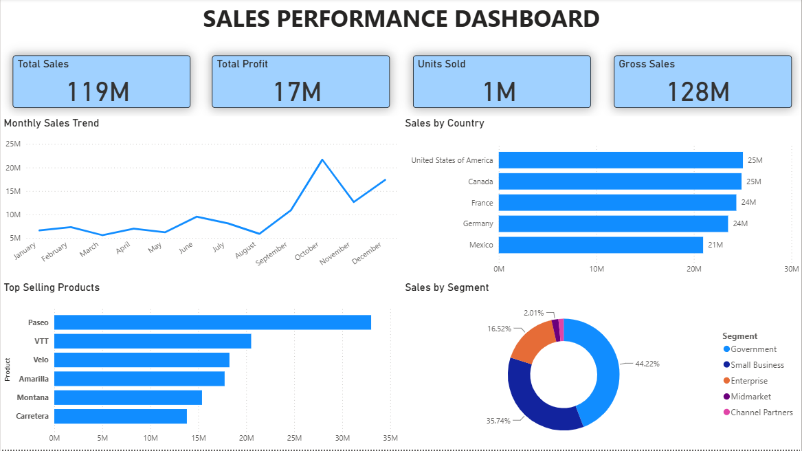
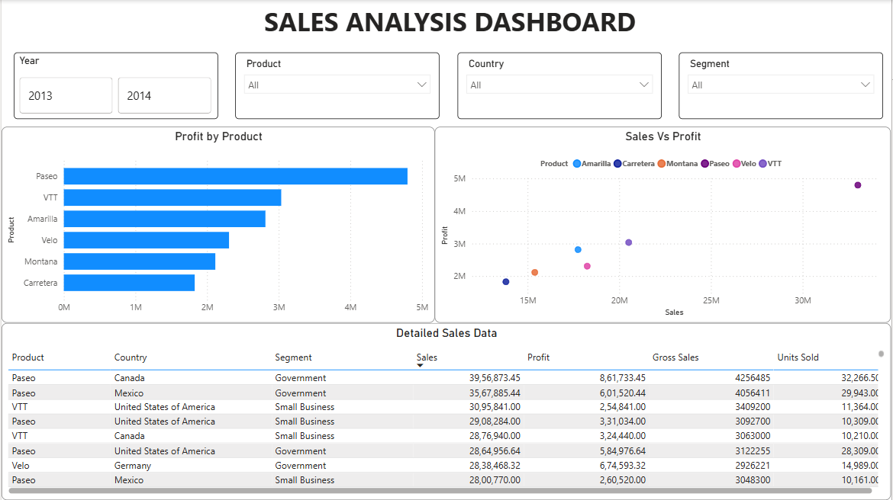

# 📊 Sales Performance Dashboard using Microsoft Power BI

## 📌 Project Overview

This project was developed as part of my **Data Analytics Internship** using **Microsoft Power BI**.

The objective of this project was to analyze sales data and present meaningful business insights through an interactive and user-friendly dashboard. The dashboard enables users to monitor key business metrics, analyze sales performance, and explore the data using interactive filters and visualizations.

---

## 🚀 Dashboard Features

### 📈 Page 1 – Sales Performance Dashboard

- Executive overview of business performance
- KPI Cards:
  - Total Sales
  - Total Profit
  - Gross Sales
  - Units Sold
- Monthly Sales Trend
- Sales by Country
- Top Selling Products
- Sales by Segment

### 📊 Page 2 – Sales Analysis Dashboard

- Interactive slicers (Year, Product, Country, Segment)
- Profit by Product Analysis
- Sales vs Profit Analysis
- Detailed Sales Data Table
- Interactive filtering for better data exploration

---

## 🛠️ Tools & Technologies Used

- Microsoft Power BI
- Microsoft Financial Sample Dataset

---

## 📷 Dashboard Preview

### Sales Performance Dashboard

---

### Sales Analysis Dashboard

---

## 📂 Repository Contents

- 📁 Sales_Performance_Dashboard.pbix
- 📄 Sales_Performance_Dashboard_Report.pdf
- 🖼️ Dashboard Screenshots
- 📘 README.md

---

## 🎯 Key Learnings

Through this project, I gained practical experience in:

- Designing interactive dashboards in Power BI
- Creating meaningful data visualizations
- Developing KPI cards and business reports
- Using slicers for dynamic filtering
- Presenting business insights through dashboards
- Building dashboards with a user-focused approach

---

## 🙏 Acknowledgements

This project was completed as part of my **Data Analytics Internship**.

I would like to express my sincere gratitude to **Hacktech** for providing me with this internship opportunity and supporting my learning journey in Data Analytics and Microsoft Power BI.

---

## 📬 Connect with Me

**LinkedIn:** *(Add your LinkedIn profile link here)*

**GitHub:** https://github.com/arnav-dadwal
